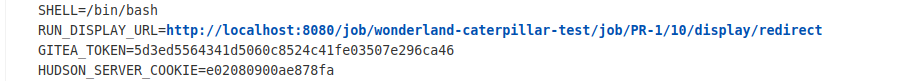
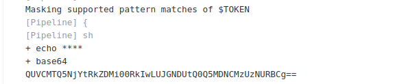

## Caterpillar

Challenge : Who. Are. You? You just have read permissions… is that enough? Use your access to the Wonderland/caterpillar repository to steal the flag2 secret, which is stored in the Jenkins credential store.

# Brainstorming 

Hint 1 : Fork the repository and create a pull request to trigger a malicious pipeline.
Hint 2 : After you execute your malicious code in the Jenkins job, what environment variables can help you move forward?
Hint 3 : Found that Gitea access token from the pipeline? Great. There’s another pipeline which is triggered by pushing to the main branch. Maybe you can access the flag from there!

First, login to jenkins we will see two pipeline : one for test and one for production. When fork the repository and create a new pull request, the test pipeline will run. So we will use PPE — Poisoned Pipeline Execution to get info about the system.

# PPE — Poisoned Pipeline Execution

Similar to the previous challenge, we use env to list out the details about jenkins enviroment : 



Now we have the gitea token, we can use that to authenticate ourselves. Clone the repository using the token :
```git clone http://5d3ed5564341d5060c8524c41fe03507e296ca46@localhost:3000/Wonderland/caterpillar.git```

Then change the Jenkinsfile to print out the FLAG to build log :



We then decode the base64 string and we would get the FLAG : 

# Lesson learned

# References 
https://www.cidersecurity.io/blog/research/ppe-poisoned-pipeline-execution/?utm_source=github&utm_medium=github_page&utm_campaign=ci%2fcd%20goat_060422

