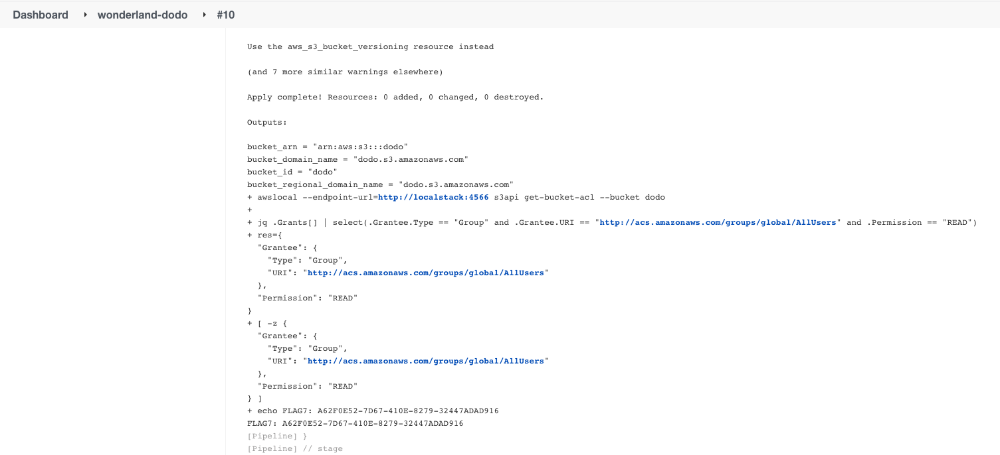

## Dodo

Challenge : Everybody has won, and all must have prizes! The Dodo pipeline is scanning you. Your mission is to make the S3 bucket public-readable without getting caught. Collect your prize in the job’s console output once you’re done.

# Brainstorming

Hint 1 : Read about Checkov, which is the scanner that stops you from making a mess.

Hint 2 : Read about Malicious Code Analysis.

# Malicous code analysis

Running security scans in CI pipelines is a common practice. Checkov, a static code analysis tool for IaC, is a known example for such a scanner.

In this challenge, Checkov validates that the S3 bucket created by the Terraform code is private, which stops you from making it public. The check can be bypassed by overriding the Checkov configuration, using the Malicious Code Analysis vector.

Clone the Wonderland/dodo repository.

Modify the ACL of the dodo S3 bucket under main.tf to:

```acl           = "public-read"```

Create a file named .checkov.yaml with the following content. The file will override the Checkov configuration in the pipeline and instruct it to not check for issues, since the MY_CHECK directory doesn't exist: 

```
soft-fail: true
check:
  - MY_CHECK 
  ```

Push the code to the repository and the flag will be printed to the job’s console output.



# References 

https://www.cidersecurity.io/blog/research/malicious-code-analysis-abusing-sast-misconfigurations-to-hack-ci-systems/?utm_source=github&utm_medium=github_page&utm_campaign=ci%2fcd%20goat_060422
https://owasp.org/www-project-top-10-ci-cd-security-risks/CICD-SEC-01-Insufficient-Flow-Control-Mechanisms