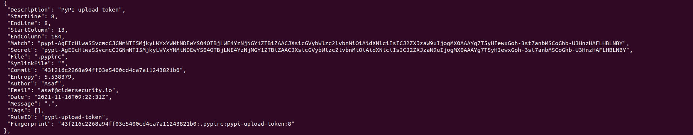

## Duchess

Challenge : If everybody minded their own business, the world would go round a deal faster than it does. Does it apply to your secrets as well? You’ve got access to the Wonderland/duchess repository, which heavily uses Python. The duchess cares a lot about the security of her credentials, but there must be some PyPi token left somewhere... Can you find it? 

# Brainstorming

It seems that the challenge temp us to find the PyPi token .By definitions, A PyPI token is an alternative way to authenticate when uploading packages to the Python Package Index (PyPI) instead of using a username and password. 

Hint : Mistakes could have been made in the past.

So it might be a secret that was deleted in the past. We would try to use a secret scanning repository .

# Scanning the repo with gitleaks

1. Clone the repository
```git clone http://localhost:3000/Wonderland/duchess.git```
2. Run Gitleaks aginst the repository :
```gitleaks detect -v -f json -r report```
3. Grab the Pypi tokens :


# Lesson learned 

Secrets are often pushed to the SCM unintentionally. This makes them accessible to any user with Read permission on the repository.

A common mistake when trying to mitigate the issue is to remove the secret from the branch where the secret was committed to, while the secret is left exposed in past commits - which are still accessible to anyone with access to the repository.

# Best practices  
If you have accidentally committed sensitive data, such as a password or an SSH key, into a Git repository, you can remove it from the history. To entirely remove unwanted files from a repository’s history, you can use either the git filter-repo tool or the BFG Repo-Cleaner open-source tool.

# References 
https://docs.github.com/en/authentication/keeping-your-account-and-data-secure/removing-sensitive-data-from-a-repository
https://www.thisdot.co/blog/a-guide-to-keeping-secrets-out-of-git-repositories/