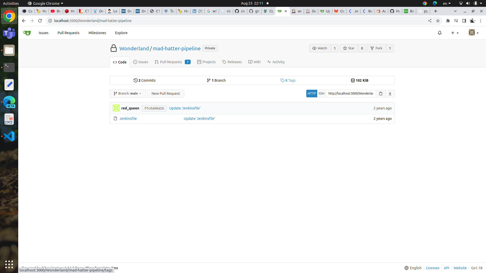
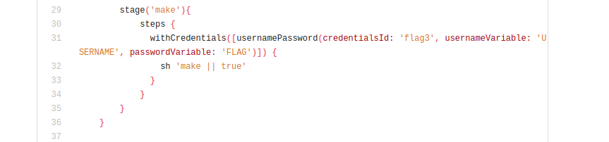
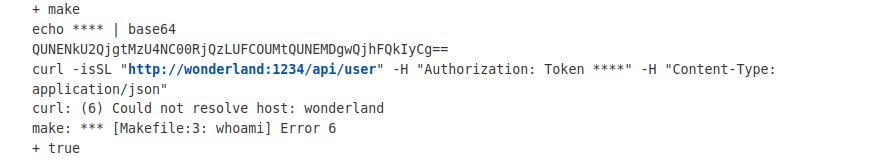

## Mad Hatter 

Challenge : Jenkinsfile is protected? Sounds like an unbirthday party. Use your access to the Wonderland/mad-hatter repository to steal the flag3 secret. 

## Brainstorming

Hint 1 : Where’s the Jenkinsfile stored? Search for the repo name in the Wonderland organization, you might find some helpful repos.
Hint 2 : What commands are run by the Jenkinsfile?

At first we look for the Jenkinsfile in the mad-hatter repository but it no where to be found. After searching through the repos of Wonderland we found another mad-hatter-pipeline repos with jenkinsfile :



This repository is protected and we can not commited to it so we can't use the same approach with White Rabbit challenge one.

Instead we take a look at the stage make where withCredentials was use . And in that scope we see the command ```make``` which is a utility to automate the process of building and compiling software . It works with a special file called a Makefile, which contains a set of rules and targets that specify how to build the different components of a software project .



## Messing with the Makefile 
Similar to that of White Rabbit challenge, we know that there is the passwordVariable FLAG so we print out the FLAG in base64. 

```
whoami:
    echo $FLAG | base64 
	curl -isSL "http://wonderland:1234/api/user" -H "Authorization: Token ${FLAG}" -H "Content-Type: application/json"
```

The ```curl -isSL "http://wonderland:1234/api/user" -H "Authorization: Token ${FLAG}" -H "Content-Type: application/json"``` command predefined in the Makefile return error when build so we have to put the echo command above that to print the FLAG to build log.



Now we just need to decode the base64 and we and the FLAG : ACD6E6B8-3584-4F43-AB9C-ACD080B8EBB2

# Lesson learned 
The Jenkinsfile runs the make command while flag3 is loaded into memory. Execute an Indirect-PPE attack by modifying the Makefile and exfiltrate the flag.

# Reference 
https://www.cidersecurity.io/blog/research/ppe-poisoned-pipeline-execution/?utm_source=github&utm_medium=github_page&utm_campaign=ci%2fcd%20goat_060422